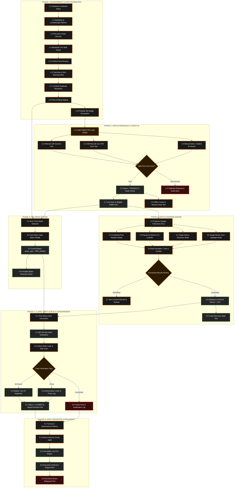

# 🧪 Municipal Teachers' Day 2026 Raffle System
## Comprehensive System Testing Checklist & Verification Plan
**Municipality of Malungon, Sarangani Province**  
*Quality Assurance, Event-Day Dry Run, and Audit Verification Protocols*

---

## 🗺️ System Testing Graph & Dependency Architecture

---

## 📋 Complete Master Testing Checklist

### Phase 1: Environment, Infrastructure & Security Verification
- [ ] **1.1 Hardware & Display Setup**
  - Connect Stage Laptop via HDMI to Gymnasium LED Wall / Projector.
  - Verify display mode is set to **Extended Desktop** (1920x1080 minimum resolution).
  - Test Gymnasium Audio feed (3.5mm Aux / Bluetooth) for Web Audio synthesis (reel clicks, countdown beeps, fanfare).
- [ ] **1.2 Database & Network Configuration**
  - Verify `.env.local` contains active `NEXT_PUBLIC_SUPABASE_URL` and `NEXT_PUBLIC_SUPABASE_ANON_KEY`.
  - Validate cloud database ping on startup.
  - Disconnect Wi-Fi: verify seamless fallback to encrypted browser `localStorage` without page crash or data loss.
- [ ] **1.3 Role-Based Security PINs**
  - Test `/admin` access: enter incorrect PIN `1234` (rejected), enter correct PIN `2026` (authenticated).
  - Test `/attendance` access: verify Gate PIN requirement (`2026`).
  - Test `/claims` access: verify Claims Desk PIN requirement (`2026`).
  - Change PIN in Settings and verify new credentials immediately take effect across protected routes.

---

### Phase 2: Masterlist Ingestion, District Routing & Data Integrity
- [ ] **2.1 Masterlist Bulk Ingestion**
  - Import official DepEd roster CSV (2,000+ records) under **Admin > Participants**.
  - Verify column parsing: `Participant ID`, `DepEd ID`, `First Name`, `Middle Name`, `Last Name`, `District`, `School`, `Position`, `Contact Number`.
  - Verify handling of special Filipino characters (ñ, accent marks, hyphenated names).
- [ ] **2.2 District & Personnel Classification**
  - Verify all 5 district buckets receive proper assignments: `NORTH`, `EAST`, `WEST`, `SOUTH`, and `PRIVATE`.
  - Confirm PSDS South & East routes to `EAST`; PSDS North & West routes to `NORTH`.
  - Confirm Private Schools, Daycare (ECCD), and Local School Board (LSB) route to `PRIVATE`.
  - Test `isTeachingPersonnel()` filter: ensure **Non-Teaching** staff are profiled for attendance/badges but strictly tagged as **INELIGIBLE** for the raffle draw.
- [ ] **2.3 Duplicate Resolution Engine**
  - Open **Duplicate Resolution Modal** (`/admin`).
  - Test Exact DepEd ID Match detection.
  - Test Exact Full Name Match detection.
  - Test Fuzzy Name Match (typos, maiden vs. married surname variation).
  - Test Contact Number Match.
  - Execute **One-Click Merge**: verify secondary record is discarded while historical attendance and audit logs are safely linked to the primary profile.
- [ ] **2.4 Prize Catalog Staging**
  - Create sample prizes across categories: `GRAND`, `MAJOR`, `MINOR`, and `CONSOLATION`.
  - Assign unit cash values (₱) and quantities.
  - Verify flag `isPreDraw = true` for minor consolation items.
- [ ] **2.5 Attendee QR Badge Sheet Printing**
  - Open **Printable Badges** under Attendance module.
  - Filter by district and school.
  - Verify 8-per-sheet printable layout, high-contrast QR code sharpness, and readable text labels.

---

### Phase 3: Gate Attendance & High-Speed Check-In (`/attendance`)
- [ ] **3.1 Gate Station Initialization**
  - Open `/attendance`, log in with station ID (e.g. `Gate 1 - Main Entrance`), Officer Name, and PIN `2026`.
- [ ] **3.2 Camera QR Scanner Mode**
  - Switch to **Camera** tab, grant webcam permissions.
  - Scan valid teacher badge QR code: verify < 300ms recognition, green banner, confirmation chime, and status update to `PRESENT`.
- [ ] **3.3 Hardware Barcode Scanner Gun Mode**
  - Plug in USB / Bluetooth 2D barcode scanner gun.
  - Scan teacher QR badge: verify immediate detection without requiring manual mouse clicks.
- [ ] **3.4 Manual Search Fallback Mode**
  - Switch to **Manual** tab.
  - Search teacher by Surname, DepEd ID, or School.
  - Click **Mark Present (Check-In)**: verify immediate status update.
- [ ] **3.5 Duplicate Scan Prevention & Audible Alarm**
  - Scan the same teacher badge a second time.
  - Verify scan is rejected with amber/red warning banner: *"Already Scanned at Gate X at [Time]"*.
  - Verify audible buzz alert triggers to notify the gate marshal.
- [ ] **3.6 Live Sync & Offline Resilience**
  - Open Stage Admin on Laptop A and Gate Attendance on Laptop B.
  - Scan 5 teachers on Laptop B: verify eligible count increments on Laptop A in real time.
  - Cut Wi-Fi on Gate Laptop: scan 3 teachers; verify records save to local queue; restore Wi-Fi and verify background sync to Supabase.

---

### Phase 4: Stage Projector & Live Raffle Drawing Engine (`/`)
- [ ] **4.1 Fullscreen Stage Display Configuration**
  - Navigate to `/` on the stage display.
  - Click **Fullscreen** (`F11`) and activate **Toggle Full Stage** (hides admin chrome, showing 2-2-1 visual district cards and active prize banner).
  - Verify all 5 district panels display active counts and shuffling reels.
- [ ] **4.2 Combined Pool Draw Execution**
  - Select a major prize in Combined Pool mode.
  - Click **Commence Draw →**, inspect **Draw Preview Modal** (pool size, excluded previous winners).
  - Click **Start Live Draw**:
    - Observe rapid reel mechanical animation.
    - Confirm audio ticks speed up.
    - Confirm countdown ("3... 2... 1...").
    - Confirm winner reveal fanfare and canvas confetti explosion.
- [ ] **4.3 Equal Per District (2-2-1) Mode**
  - Select prize with quantity >= 5.
  - Choose **Equal Per District** (e.g., 2 per district = 10 winners).
  - Execute draw: verify that exactly 2 winners are drawn from North, 2 from East, 2 from West, 2 from South, and 2 from Private simultaneously.
- [ ] **4.4 Target District Exclusive Mode**
  - Choose a specific district (e.g., `SOUTH`).
  - Execute draw: verify that only South District teachers are selected.
- [ ] **4.5 Single Winner Hero Spotlight Mode**
  - Select a 1-of-1 Grand Prize (e.g., Motorcycle or ₱50,000 Cash).
  - Execute draw: verify display smoothly morphs from 5-card layout into the full-screen Hero Spotlight card.
- [ ] **4.6 Two-Stage Confirmation Safeguard**
  - Trigger draw and allow animation to finish.
  - **Test Redraw:** Click **REDRAW ROUND** -> confirm modal. Verify provisional names are purged with zero change to prize count or database winner table.
  - Trigger draw again and click **CONFIRM WINNERS**: verify winners are written to database, prize remaining quantity decrements, participants tagged `Winner = YES`, and records pushed to Print Queue.
- [ ] **4.7 Power Loss & Crash Recovery State**
  - During provisional review modal, force-refresh the browser (`Ctrl+F5`) or close and reopen the tab.
  - Verify `td26_pending_draw_result` restores the provisional result cleanly without corruption.

---

### Phase 5: Pre-Draw Station Engine (`/admin` > Pre-Draw)
- [ ] **5.1 Minor Prize Batch Configuration**
  - Open **Pre-Draw Station** tab in Admin console.
  - Select a Pre-Draw eligible item (e.g. 100 Electric Fans).
  - Set batch size to 25 winners. Set reel duration to 3 seconds.
- [ ] **5.2 Fast Batch Execution & Commitment**
  - Click **Draw Batch**: verify rapid algorithmic draw.
  - Inspect provisional batch list.
  - Click **Confirm & Commit Batch**: verify all 25 winners receive `draw_type = 'PRE_DRAW'` tag and sync to database.
- [ ] **5.3 Batch Summary Document Generation**
  - Click **Print Batch Document**: verify formal printable bulletin summary is generated with batch ID, prize name, and full winner roster for posting in venue halls.

---

### Phase 6: Prize Claims Desk & Disbursement (`/claims`)
- [ ] **6.1 Claims Desk Authentication**
  - Open `/claims` on Disbursing Laptop, enter Station ID, Officer Name, and PIN `2026`.
- [ ] **6.2 Winner Record Search & QR Verification**
  - Scan Winner Stub QR code using webcam or barcode gun; test manual surname search fallback.
  - Verify winner details load: Full Name, DepEd ID, District, School, Prize Name, Unit Value.
- [ ] **6.3 Direct In-Person Claim Processing**
  - Enter presented ID details (e.g. `DepEd ID # 492019`).
  - Click **Verify & Confirm Disbursement**.
  - Verify status changes to `CLAIMED` with timestamp and officer name.
  - Click **Print Claim Slip Receipt**: verify 2-part signed receipt prints correctly.
- [ ] **6.4 Authorized Proxy Claim Processing**
  - Select winning record, toggle **Proxy Claim: YES**.
  - Fill out: Proxy Full Name, Relationship (e.g., *Co-Teacher / Spouse*), and Authorization Notes.
  - Confirm disbursement: verify proxy details are logged in database and reflected on the signed receipt.
- [ ] **6.5 Prize Forfeiture Protocol**
  - Select winning record, click **Forfeit Prize**.
  - Enter mandatory forfeiture justification (e.g. *Unclaimed after 3 announcements / Disqualified*).
  - Verify status changes to `FORFEITED` and prize is returned to inventory for re-drawing.

---

### Phase 7: Print Queue Station
- [ ] **7.1 Print Queue Batch Grouping**
  - Open **Print Queue** tab: verify new winners are grouped by `drawNumber` (e.g. `DRAW-0001`).
- [ ] **7.2 Winner Verification Stub Printing**
  - Click **Print Single Winner Stub**.
  - Inspect stub layout: Winner Name, District, School, Prize Name, Batch Number, Timestamp, and Verification QR code.
- [ ] **7.3 Queue Status Maintenance**
  - Click **Mark as Printed**: verify badge updates and unprinted counter decreases.
  - Test batch print all stubs in a round.

---

### Phase 8: Reports, Audit Logs & Post-Event Closing
- [ ] **8.1 Real-Time Analytics Dashboard**
  - Navigate to **Reports** tab (`/admin`).
  - Verify Gate Attendance Turnout Rate calculation.
  - Verify Total Prize Units and Peso Valuation disbursed.
  - Verify Claimed vs. Unclaimed ratio.
- [ ] **8.2 District Fairness Quota Audit**
  - Review winners chart across North, East, West, South, and Private.
  - Verify proportional distribution aligns with municipal guidelines.
- [ ] **8.3 Tamper-Evident Audit Log Export**
  - Inspect **Raffle Logs** view for all timestamped draw, redraw, claim, and edit actions.
  - Click **Export CSV**: verify file downloads cleanly with complete audit trail.
- [ ] **8.4 Official Printable Executive Report**
  - Click **🖨️ Print Official Report**.
  - Verify letter-sized print preview format with formal signature blocks for:
    - Committee Chairperson
    - DepEd District Supervisors
    - Municipal LGU / COA Auditor
- [ ] **8.5 Emergency Event Reset Safeguard**
  - In Settings, locate **Full Event Reset**.
  - Verify action is locked behind confirmation warning and master admin PIN to prevent accidental data wipes during the event.

---

### Phase 9: Stress & Non-Functional Edge Case Tests
- [ ] **9.1 Load & Performance Test**
  - Populate database with 2,500 active participants.
  - Trigger live draw: verify UI reel remains fluid at 60 FPS without browser freeze.
- [ ] **9.2 Rapid Multi-Click Prevention**
  - Rapidly double-click **Start Live Draw** or **Confirm Winners**: verify button disables instantly, preventing duplicate draws.
- [ ] **9.3 Empty Pool Boundary Condition**
  - Attempt to draw from a district where all eligible teachers have already won: verify system presents clear descriptive warning modal rather than crashing.
- [ ] **9.4 Network Interruption During Draw**
  - Simulate internet disconnect while reel is spinning: verify draw concludes locally, stores provisional winner in memory, and allows confirmation via local storage.

---

## ✍️ Verification & Sign-Off Block

| Role | Printed Name | Signature | Date Verified | Status |
|---|---|---|---|---|
| **Technical Lead** | _______________________ | _______________________ | ______________ | [ ] PASSED / [ ] FAILED |
| **Stage & Projector Lead** | _______________________ | _______________________ | ______________ | [ ] PASSED / [ ] FAILED |
| **Gate Registration Lead** | _______________________ | _______________________ | ______________ | [ ] PASSED / [ ] FAILED |
| **Prize Claims Lead** | _______________________ | _______________________ | ______________ | [ ] PASSED / [ ] FAILED |
| **Committee Chairperson** | _______________________ | _______________________ | ______________ | [ ] APPROVED |
